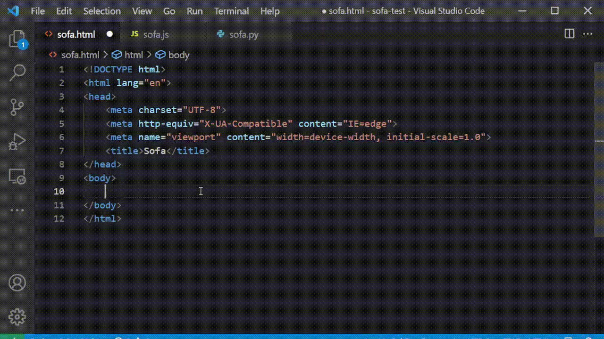

# Sofa (Stackoverflow Answers) Extension

Sofa is a  **open-source**  MIT-licensed  **vscode extension**  that is designed to speed up your coding time by bringing you the answers related to your problem on stackoverflow.com.

## Features

- Retrieves all answers and scrapes the code out of them for you to use it. 
- Retrieved codes can be selected from vscode QuickPick.
- Language of the current file is added to your question automatically.
- Opens your browser and directs you to the stackoverflow page (optional)

## Usage

- Type your problem and press ctrl + enter to retrieve the codes. You can pick on of the results from vscode.QuickPick. Press ctrl + enter again to get the stackoverflow question page.



### Examples

- Python

```py
# read line by line
with open(filename) as file:
    lines = file.readlines()
    lines = [line.rstrip() for line in lines]
```

- Html

```html
<!-- div side by side -->
<div style="width: 100%; display: table;">
    <div style="display: table-row">
        <div style="width: 600px; display: table-cell;"> Left </div>
        <div style="display: table-cell;"> Right </div>
    </div>
</div>
```
- Javascript

```js
 // traverse all elements
var all = document.getElementsByTagName("*");
for (var i = 0; i < all.length; i++) {
    console.log(all[i].nodeName);
}
```


